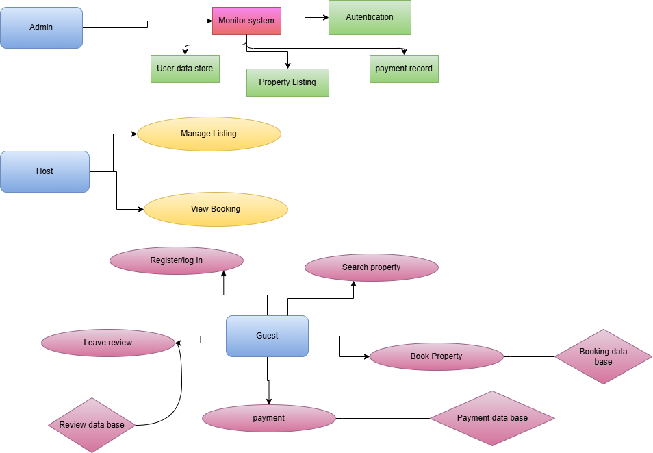

# 🔄 Airbnb Clone – Data Flow Diagram (DFD)

This Data Flow Diagram (DFD) illustrates how data flows between users, system processes, and data stores in the Airbnb Clone backend.

## 🎯 Purpose

The DFD maps out the flow of information for key functionalities such as user registration, booking, payment, and review management.

## 👤 External Entities

- Guest
- Host
- Admin

## 🔁 Processes

- Register/Login
- Search Properties
- Create Booking
- Make Payment
- Manage Listings
- Leave Review
- Admin Monitoring

## 💾 Data Stores

- User Database
- Property Listings
- Bookings
- Payments
- Reviews

## 🖼️ Diagram

> Created using Draw.io and exported as `data-flow.png`.

