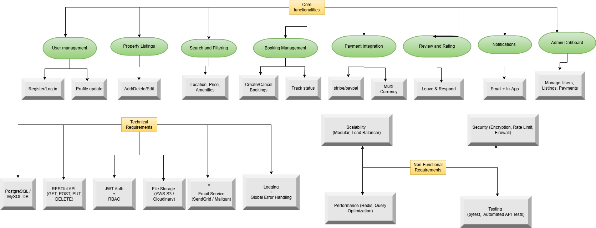

# 📌 Features and Functionalities – Airbnb Clone Backend

This document outlines the **key features and functionalities** required for the backend of the Airbnb Clone project. These features are based on core requirements, technical needs, and non-functional expectations to ensure the system is secure, scalable, and efficient.

---

## 🔑 Core Functionalities
- **User Management**:  
  Users can register or log in (via JWT or OAuth) and update their profiles.

- **Property Listings**:  
  Hosts can add, edit, or delete their property listings.

- **Search and Filtering**:  
  Guests can search listings by location, price, number of guests, and amenities.

- **Booking Management**:  
  Guests can book, cancel, and view booking statuses (e.g., confirmed, canceled).

- **Payment Integration**:  
  Secure payments through Stripe or PayPal with support for multiple currencies.

- **Reviews and Ratings**:  
  Guests can leave reviews, and hosts can respond. Each review is tied to a completed booking.

- **Notifications**:  
  Email and in-app alerts for booking confirmations, cancellations, and payment updates.

- **Admin Dashboard**:  
  Admins can monitor and manage users, properties, bookings, and payments.

---

## 🛠️ Technical Requirements
- **Database**: PostgreSQL or MySQL  
- **API**: RESTful endpoints with standard HTTP methods  
- **Authentication**: JWT tokens with Role-Based Access Control (RBAC)  
- **File Storage**: AWS S3 or Cloudinary  
- **Email Service**: SendGrid or Mailgun  
- **Logging**: Global error handling with system-wide logging mechanisms

---

## 🚀 Non-Functional Requirements
- **Scalability**: Modular design with load balancing  
- **Security**: Data encryption, firewalls, rate limiting  
- **Performance**: Caching with Redis and optimized DB queries  
- **Testing**: Unit and API testing using tools like `pytest`

---

## 🖼 Feature Map Diagram

Below is a visual representation of the system’s features and their classification:

